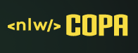
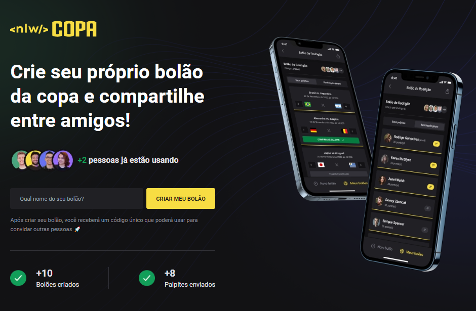
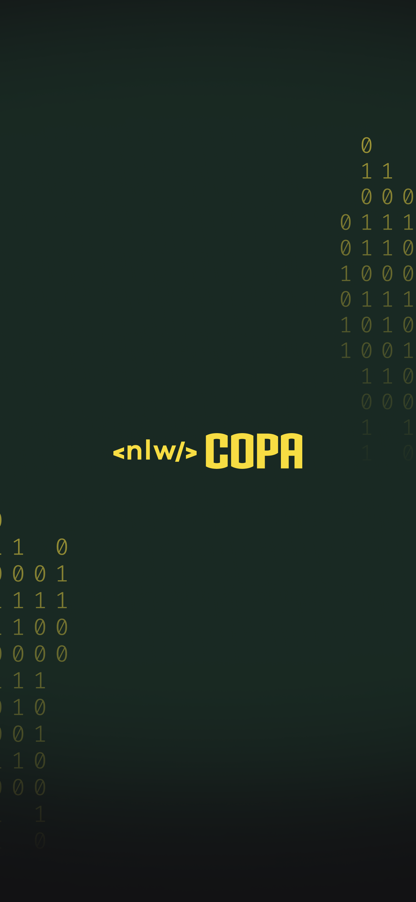
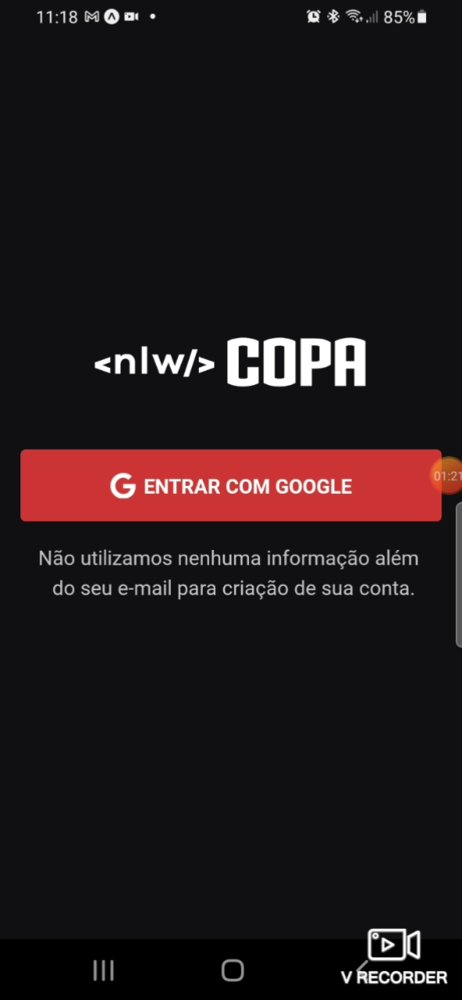
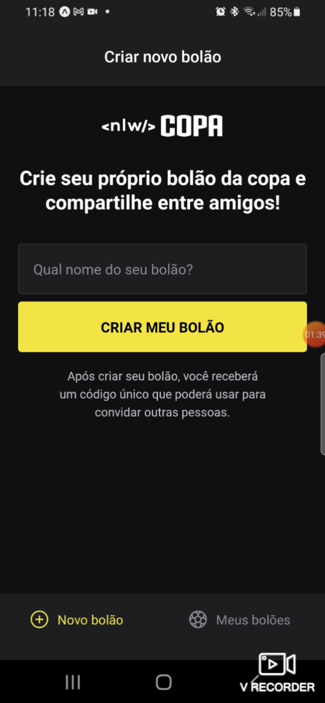

<div align="center">

</div>

<h3 align="center">🚀 Projeto desenvolvido durante a NLW Copa, trilha Ignite, da Rocketseat</h3>

<p align="center">
<a href="#-sobre">Sobre</a> •
<a href="#-features">Features</a> •
<a href="#-instalacao">Instalação</a> •
<a href="#-tecnologias">Tecnologias</a> •
<a href="#-autor">Autor</a>
</p>

<h4 align="center"> 
	🚧 em construção... 🚧
</h4>

## 🎮 Sobre

Essa aplicação permite a criação de bolões para a Copa do Mundo 2022. Os bolões podem ser compartilhados para que outras pessoas possam acessar e deixar seus palpites.
Para a criação do bolão só é necessário um título (na versão web e mobile), que gera um código que pode ser utilizado por usuários logados para participar deste bolão (versão mobile).

Visualização na versão web:


Visualização na versão mobile:

<div align="center">



</div>

Esse projeto foi proposto pela [Rocketseat](https://www.rocketseat.com.br/) durante a NLW Copa - Trilha Ignite. Nesse evento de uma semana, o objetivo era desenvolver e aprender juntos, com muita prática, as versões web e mobile (junto com o back end) dessa aplicação utilizando o React e o React Native.

## ✨ Features

- [x] Criação de bolões (versões web e mobile)
- [x] Compartilhamento de código criado
- [x] Login Social com Google (versão mobile)
- [x] Autenticação dos dados na criação dos bolões e palpites
- [ ] Login Social com Google (versão web)

## ℹ Instalação

Antes de começar, é necessário ter instalado em sua máquina as seguintes ferramentas:
[Git](https://git-scm.com), [Node.js](https://nodejs.org/en/).
Além disto é bom ter um editor para trabalhar com o código como [VSCode](https://code.visualstudio.com/).
Para rodar a versão mobile, além das ferramentas acima é necessário intalar o [expo-cli](https://expo.io/) globalmente em seu computador:

```bash
$ npm install -g expo-cli

ou

$ yarn global add expo-cli

```

e o aplicativo Expo Go no seu aparelho celular, basta buscar nas lojas pelo aplicativo Expo Go (recomendado) ou instalar um emulador Android ou iOS (para macOS) em sua máquina.

### 🎲 Rodando o Back End (servidor)

```bash
# Clone este repositório
$ git clone https://github.com/derekcsantos/nlw-copa-mobile

# Acesse a pasta do projeto no terminal/cmd
$ cd nlw-copa-mobile

# Vá para a pasta server
$ cd server

# Instale as dependências
$ npm install

# Execute a aplicação em modo de desenvolvimento
$ npm run dev

# O servidor inciará na porta:3333 - acesse <http://localhost:3333>
```

### 📱 Rodando a aplicação mobile (Front End)

```bash
# Clone este repositório
$ git clone https://github.com/derekcsantos/nlw-copa-mobile
# Acesse a pasta do projeto no seu terminal/cmd
$ cd nlw-copa-mobile
# Vá para a pasta da aplicação mobile
$ cd mobile
# Instale as dependências
$ npm install
# Com o celular e o computador  conectados na mesma rede, execute a aplicação em modo de desenvolvimento
$ expo start
# No app Expo GO, basta ler o QR Code gerado no terminal ou seguir as instruções da tela
```

## 🛠 Tecnologias e ferramentas utilizadas

As seguintes ferramentas foram usadas na construção do projeto:

- [VSCode](https://code.visualstudio.com/)
- [Expo](https://expo.io/)
- [Node.js](https://nodejs.org/en/)
- [Next](https://nextjs.org/)
- [React](https://pt-br.reactjs.org/)
- [React Native](https://reactnative.dev/)
- [TypeScript](https://www.typescriptlang.org/)
- [Prisma](https://www.prisma.io/)
- [TailwindCSS](https://tailwindcss.com/)
- [Phosphor Icons](https://phosphoricons.com/)
- [Prettier](https://marketplace.visualstudio.com/items?itemName=esbenp.prettier-vscode)
- [ESlint](https://marketplace.visualstudio.com/items?itemName=dbaeumer.vscode-eslint)
- [PostCSS](https://marketplace.visualstudio.com/items?itemName=csstools.postcss)

## 👨🏾‍💻 Autor

<a href="https://github.com/derekcsantos">
 
 <br />
 <sub><b>Derek Santos</b></sub></a </a>

<p>Feito com muita dedicação por Derek Santos 👋🏽 Entre em contato!</p>

[](https://twitter.com/derekcsantos) [](https://www.linkedin.com/in/tgmarinho/)
[](mailto:derekcsantos@gmail.com)
